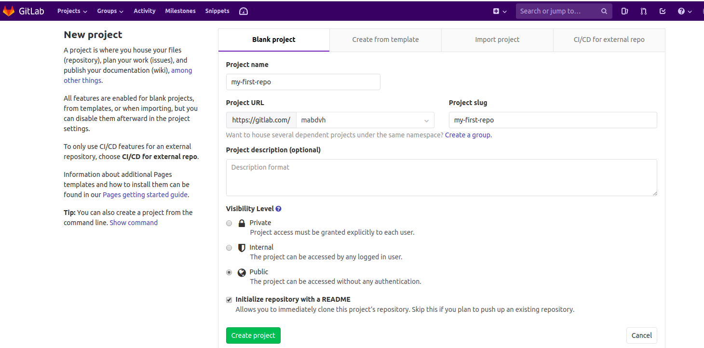
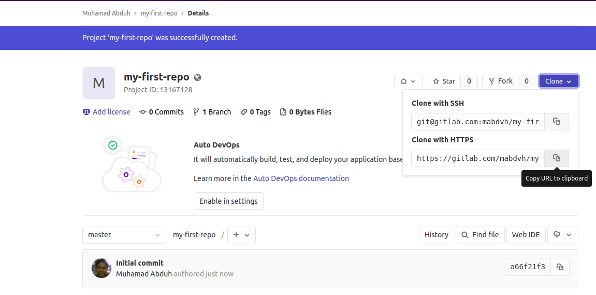

# Menggunakan Gitlab

Pastikan sudah install git di komputer anda. Jika belum terinstall silakan ikuti langkah-langkahnya di sini: [https://www.digitalocean.com/community/tutorials/how-to-contribute-to-open-source-getting-started-with-git](https://www.digitalocean.com/community/tutorials/how-to-contribute-to-open-source-getting-started-with-git)

## Membuat Repository Baru

Repository atau repo di Gitlab biasa disebut dengan project. Berikut langkah-langkah untuk membuat repository baru: 

* Setelah login anda akan menuju halaman Projects yang berisi semua repository yang anda miliki. Jika Anda user baru maka belum ada repository yang tersedia. Di halaman tersebut anda akan melihat tombol New Project di sebelah kanan atas. Klik tombol tersebut.


* Pada halaman membuat project baru, isi kolom project-name dengan nama yang Anda inginkan, misalkan: my first repo. 
* Pada kolom visibility level Anda akan melihat tiga pilihan yaitu Private, Internal, dan Public. Private artinya repo yang akan kita buat bersifat rahasia, hanya Anda dan orang yang Anda beri akses saja yang bisa membukanya. Sedangkan pilihan Internal berarti repo Anda akan dapat dilihat oleh semua user Gitlab. Pilihan "Public" berarti repo Anda akan terlihat oleh orang dari mana saja walaupun dia tidak memiliki akun gitlab. Pilih yang sesuai kebutuhan misalkan : Public.
* Di bagian bawahnya terdapat pilihan checkbox "Initialize repository with a README". Centang saja jika anda ingin langsung clone repository nya setelah dibuat. 



* Jika berhasil maka Anda akan diarahkan menuju halaman project atau repo yang telah dibuat. Jika sebelumnya kita centang "Initialize repository with a README" maka repository kita akan berisi file README.md. 
* Pada Bagian kanan atas terdapat tombol clone. Ketika diklik maka akan keluar dua pilihan "Clone with SSH" dan "Clone with HTTPS". Jika ingin clone dengan SSH maka anda harus setting dulu akun anda agar terhubung dengan komputer Anda. Atau pilih saja clone dengan HTTPS. Klik tombol salin/copy supaya langsung otomatis tercopy pada clipboard.   



* Setelah itu menuju ke terminal atau cmd. Arahkan menuju folder dimana anda ingin menyimpan repository yang sudah Anda buat. Berikan perintah git clone &lt;link\_anda\_yang\_barusan\_dicopy&gt;

```bash
git clone <your_repository_link_url> 
```

* Jika sudah berhasil diclone maka akan ditemukan folder dengan nama repository di Gitlab. Cara mengeceknya dengan perintah "ls" atau "dir". 

```bash
$ ls
my-first-repo  
```

## Mengupload perubahan project dengan git push

Ketika kita sudah berhasil clone repository kita di Gitlab maka tentu kita ingin melakukan update atau penambahan code pada project kita. Agar perbaruan yang kita simpan di local \(komputer\) kita dapat kita perbaharui juga di repository Gitlab maka kita bisa lakukan dengan git push. Berikut langkah-langkahnya: 

* Ketika kita sudah memberikan perubahan terhadap suatu file atau membuat folder-folder baru pada folder project kita maka cara mengecek status perbaruan adalah dengan git status

```bash
$ git status
On branch master
Your branch is up to date with 'origin/master'.

Changes not staged for commit:
  (use "git add <file>..." to update what will be committed)
  (use "git checkout -- <file>..." to discard changes in working directory)

	modified:   README.md

no changes added to commit (use "git add" and/or "git commit -a")
```

* Setelah git status maka akan ditampilkan list file yang "modified" atau "untracked". "modified" artinya adalah kita mengubah file yang sebelumnya ada sedangkan "untracked" artinya file tersebut sama sekali baru di repository. Dalam contoh di atas terdapat perubahan pada file "README.md". 
* Untuk menaikkan perubahan \(stage\) yang kita buat maka berikan perintah git add 

```bash
$ git add README.md
// Jika ada terdapat banyak file dan kita ingin naikkan semuanya maka perintahnya: 
$ git add . 
```

* Sekarang perubahan tadi sudah pada tahap "staged". jika kita status nya lagi maka akan didapati berbeda: 

```bash
$ git status 
On branch master
Your branch is up to date with 'origin/master'.

Changes to be committed:
  (use "git reset HEAD <file>..." to unstage)

	modified:   README.md

```

* Selanjutnya adalah memberikan laporan atau commit terhadap perubahan yang kita buat dengan git commit.

```text
$ git commit -m "Pesan saya: Mengubah README.md"
```

* tanda "-m" pada perintah commit artinya kita ingin memberikan pesan atau laporan terhadap perubahan yang sudah dibuat. Dalam hal ini laporannya adalah "Pesan saya: mengubah README.md"
* Selanjutnya adalah push untuk mengirim /upload perubahan yang ada di local computer kita menuju repository yang ada di Gitlab. Jika kita berada di branch bernama master maka perintahnya adalah:

```bash
$ git push origin master 
```

Jika branch yang sedang kita miliki di local adalah branch lain selain master maka cara push nya adalah 

```bash
$ git push origin <nama_branch>
```

 Jika langkah tersebut sudah maka kita sudah berhasil mengupload  perubahan yang kita buat di repository kita. 🥂 


