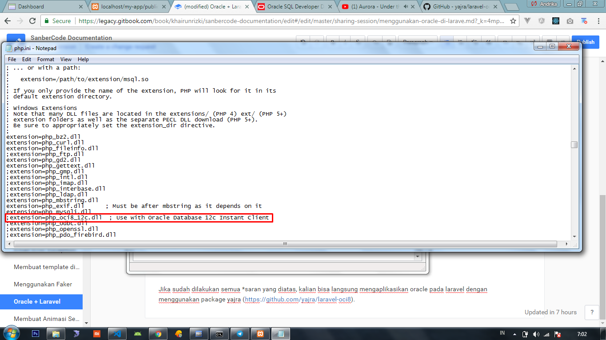
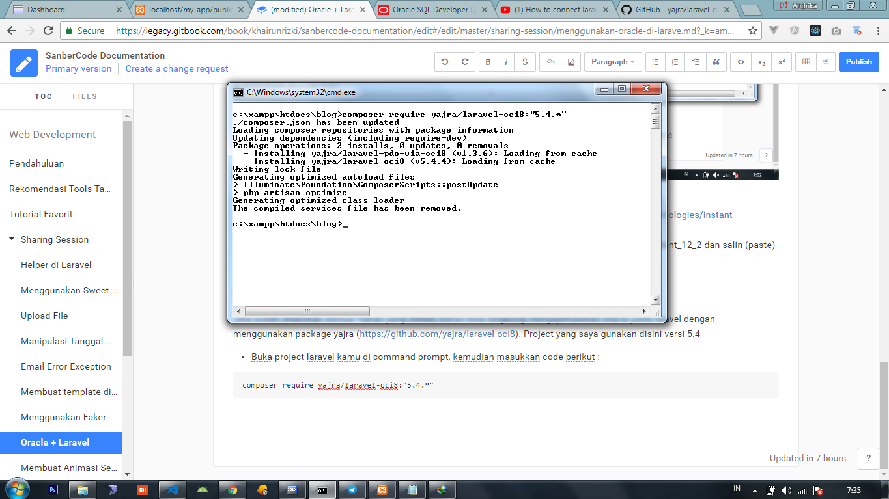
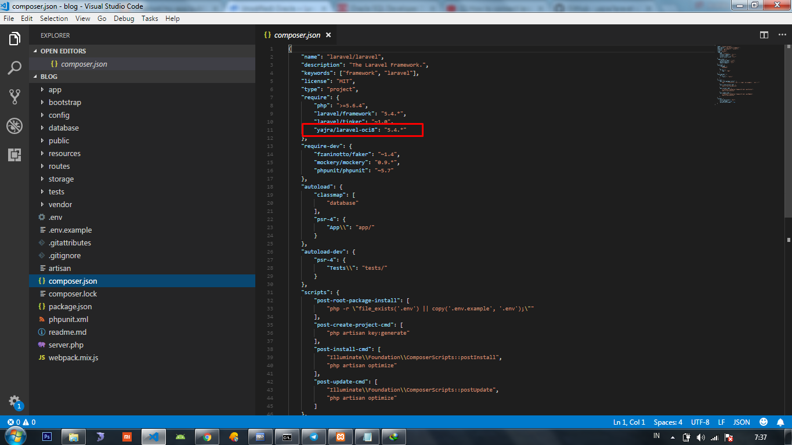
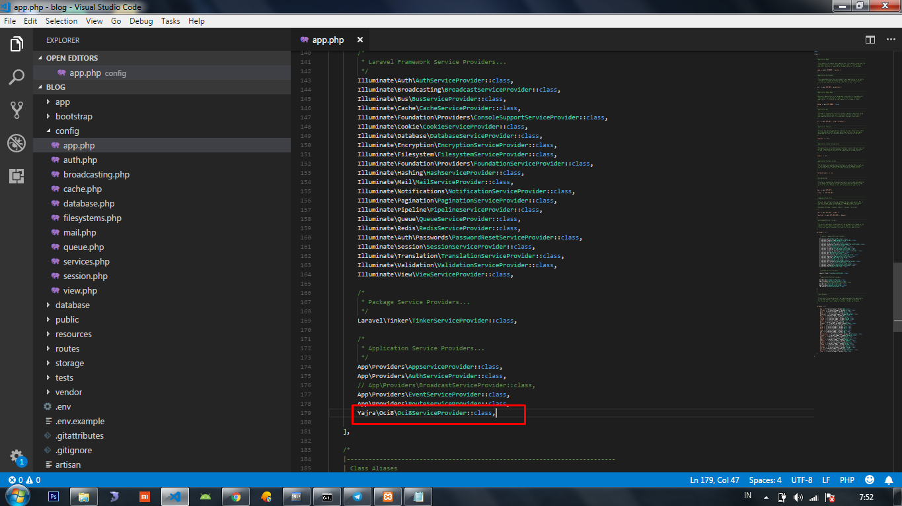

# Oracle + Laravel

### 08/Mei/2018 \(By: Andrika\)

## Step 1

Untuk mengintegrasikan laravel dengan oracle, saran saya menggunakan laravel versi 5.4 atau 5.3, karena sedikit sekali permasalahan yang kalian akan jumpai nantinya ketika mengistall package dari Mas Yajra \( [https://yajrabox.com/ ](https://yajrabox.com/)\). Hal yang harus kalian lakukan adalah mempersiapkan tools yang dibutuhkan pastinya, cek link dibawah:

* Oracle : [http://www.oracle.com/technetwork/database/database-technologies/express-edition/downloads/index.html](http://www.oracle.com/technetwork/database/database-technologies/express-edition/downloads/index.html)
* Untuk lebih mengoptimalkan oracle Download Sql Developer : [http://www.oracle.com/technetwork/developer-tools/sql-developer/downloads/index.html](http://www.oracle.com/technetwork/developer-tools/sql-developer/downloads/index.html)

Keterangan:

* untuk memudahkan dalam mengisntallnya coba tonton video, cek link ini [https://www.youtube.com/watch?v=Fr4pPlZnbFI&t=384s](https://www.youtube.com/watch?v=Fr4pPlZnbFI&t=384s)

## Step 2

Sebelum mencoba, setting terlebih dahulu xampp untuk memudahkan menjalankan package yajra di project kalian:

* buka php.ini di folder xampp atau bisa mengikuti gambar dibawah


* kemudian cari extension=php\_\_oci8\_\_12c.dll kemudian hapus ; \(titik koma\)



* Download instantclient\_12\_2 di link [http://www.oracle.com/technetwork/database/database-technologies/instant-client/downloads/index.html](http://www.oracle.com/technetwork/database/database-technologies/instant-client/downloads/index.html)
* Jika sudah mendownloadnya kemudian extract, salin\(copy\) semua isi yang ada di folder instantclient\_12\_2 dan salin \(paste\) ke folder C:\xampp\apache\bin.

## Step 3

Jika sudah dilakukan semua \*saran yang diatas, kalian bisa langsung mengaplikasikan oracle pada laravel dengan menggunakan package yajra \([https://github.com/yajra/laravel-oci8](https://github.com/yajra/laravel-oci8)\). Project yang saya gunakan disini versi 5.4

* Buka project laravel kamu di command prompt, kemudian masukkan code berikut :

```text
composer require yajra/laravel-oci8:"5.4.*"
```



Jika sesuai dengan perintah yang diatas artinya package dari yajra sudah berhasil terinstall , untuk mengeceknya lihat di `composer.json`



* Kemudian  buka  `config/app.php` pada file app.php  cari providers dan copy-kan code yang dibawah

> Yajra\Oci8\Oci8ServiceProvider::class,



* kemudian buat koneksi konfigurasi untuk oracle, menggunakan code dibawah:

```text
php artisan vendor:publish --tag=oracle
```

jika code diatas sudah aplikasikan/terapkan maka cek folder `config`maka akan terdapat file `oracle.php`, seperti contoh yang dibawah:

```text
'oracle' => [
    'driver'        => 'oracle',
    'tns'           => env('DB_TNS', ''),
    'host'          => env('DB_HOST', ''),
    'port'          => env('DB_PORT', '1521'),
    'database'      => env('DB_DATABASE', ''),
    'username'      => env('DB_USERNAME', ''),
    'password'      => env('DB_PASSWORD', ''),
    'charset'       => env('DB_CHARSET', 'AL32UTF8'),
    'prefix'        => env('DB_PREFIX', ''),
    'prefix_schema' => env('DB_SCHEMA_PREFIX', ''),
],
```

* Terakhir buka file auth.php yang ada pado folder config kemudian ubah eloquent menjadi oracle seperti code dibawah:

```text
'providers' => [
    'users' => [
        'driver' => 'oracle',
        'model' => App\User::class,
    ],
]
```

## Step 4

Buat database pada Oracle yang sebelumnya kalian install:

